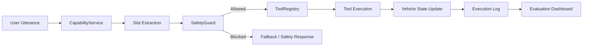
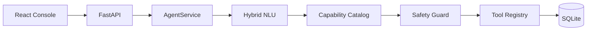

# AutoMate

**AutoMate는 차량 상태와 주행 도로 Context를 함께 이해해, 운전자의 자연어 요청을 안전한 차량 기능 Tool 호출로 변환하는 Context-Aware In-Vehicle AI Agent MVP입니다.**

사용자 발화, 차량 상태, 도로 제한속도, 주행 여부를 함께 분석하여 Intent 분류, Slot 추출, Safety 검증, Tool 실행, 실행 로그 저장, 시나리오 기반 평가까지 하나의 Agent 파이프라인으로 처리합니다.

> 이 프로젝트는 실제 차량 제어가 아닌 **시뮬레이션 기반 포트폴리오 프로젝트**입니다.

---

## 핵심 요약

- 차량 상태와 도로 Context를 함께 반영하는 In-Vehicle AI Agent
- Capability Catalog 기반 Intent / Tool 매핑 구조
- 주행 중 위험 요청을 차단하는 Safety Guard
- 9개 차량 기능 Tool 시뮬레이션
- 40개 이상의 Capability 정의 · 46개 이상의 통합 시나리오 · 140개 이상의 pytest
- React 개발 콘솔에서 실행 로그, 평가 지표, 시나리오 테스트 확인

---

## 개발 배경

차량 내 음성 인터페이스는 단순 질의응답을 넘어, 운전자의 발화 의도와 차량 상태를 함께 고려해 안전하게 기능을 수행해야 합니다.

예를 들어 **"나 좀 추워"**라는 발화는 단순 문장이 아니라, 실내 온도·외부 온도·주행 상태를 함께 고려해 공조 기능을 호출해야 하는 Context-aware 요청입니다. 또한 **"운전 중인데 화면 설정을 바꿔줘"**와 같은 요청은 안전 정책에 따라 차단되어야 합니다.

**"지금 제한속도 몇이야?"**처럼 차량 내부 상태만이 아니라 **도로 제한속도·과속 여부**까지 반영해야 하는 요청도 있습니다.

AutoMate는 이러한 차량 환경의 특성을 반영해, 자연어 이해, 차량 Context, Safety Guard, Tool Calling, 실행 로그, 시나리오 기반 평가를 하나의 Agent 시스템으로 구현한 프로젝트입니다.

---

## Demo Screens

스크린샷은 [`docs/images/`](docs/images/)에 추가하면 README에서 자동으로 표시됩니다.

### Agent Console


### Scenario Runner


### Evaluation Dashboard


---

## 주요 기능

| 영역 | 설명 |
|------|------|
| **한국어 NLU** | Rule-based NLU를 기본으로 사용하며, 환경변수 설정 시 LLM Function Calling으로 확장 가능 (`HybridNLU`) |
| **Vehicle Capability Catalog** | 차량 기능을 데이터로 정의하고 Intent / Tool / Safety를 일관되게 연결 |
| **Tool Registry** | 9개 차량 Tool 등록, Pydantic 스키마 검증, 실행 |
| **Safety Guard** | 주행 중 위험 제어 차단, 졸음 감지 시 휴게소 우선 안내, slot 누락 clarification |
| **Road Context** | 제한속도·과속 여부·도로명·어린이 보호구역 등 주행 도로 정보 응답 |
| **Execution Logs** | 요청별 intent, tool, latency, success / failure 영구 저장 |
| **Scenario Runner** | 통합 시나리오로 intent / tool / safety 정확도 자동 검증 |
| **Evaluation Dashboard** | 성공률, intent 분포, tool 사용량, 평균 latency 시각화 |

---

## 아키텍처



**Agent 파이프라인**

1. `CapabilityService`가 발화를 capability에 매칭하고 slot을 추출합니다.
2. `SafetyGuard`가 주행 상태·capability 정책을 검사합니다. (차단 시 Tool 미실행)
3. `ToolRegistry`가 tool을 실행하고 차량 상태를 갱신합니다.
4. 결과를 `final_response`로 조합하고 SQLite execution log에 저장합니다.
5. Frontend Evaluation / Scenario Runner에서 로그와 정확도를 확인합니다.

**시스템 구성 (요약)**



---

## 프로젝트 구조

```
AutoMate/
├── backend/
│   ├── app/
│   │   ├── data/
│   │   │   ├── vehicle-capabilities.json   # 차량 기능 사전
│   │   │   └── test-scenarios.json         # 통합 테스트 시나리오
│   │   ├── nlu/                            # Rule-based + Hybrid + LLM NLU
│   │   ├── safety/                         # Safety Guard
│   │   ├── services/                       # Agent, Capability, Scenario, Evaluation
│   │   ├── tools/                          # Vehicle Tool 구현체
│   │   └── routers/                        # FastAPI 라우터
│   ├── tests/                              # pytest
│   └── docs/test-scenarios.md
├── docs/images/                            # README 스크린샷
└── frontend/
    └── src/
        ├── pages/          # Agent, Logs, Evaluation, Scenarios
        ├── components/     # Vehicle Cockpit, Agent Flow, Charts
        └── api/            # Backend API 클라이언트
```

---

## 빠른 시작

### 사전 요구사항

- Python 3.11+
- Node.js 18+
- (선택) OpenAI API Key — LLM NLU 사용 시

### 1. Backend

```bash
cd backend
python3 -m venv .venv
source .venv/bin/activate        # Windows: .venv\Scripts\activate
pip install -r requirements.txt

cp .env.example .env             # 필요 시 CORS, LLM 설정 수정
uvicorn app.main:app --reload --port 8000
```

- API 문서: http://localhost:8000/docs
- Health check: http://localhost:8000/health

### 2. Frontend

```bash
cd frontend
npm install

cp .env.example .env             # VITE_API_BASE_URL=http://localhost:8000
npm run dev
```

- 개발 서버: http://localhost:5173

### 3. 테스트

```bash
cd backend
source .venv/bin/activate
python -m pytest
```

---

## 환경 변수

### Backend (`backend/.env`)

| 변수 | 기본값 | 설명 |
|------|--------|------|
| `DATABASE_URL` | `sqlite:///./automate.db` | SQLite DB 경로 |
| `CORS_ORIGINS` | `http://localhost:5173,...` | 허용 Origin (쉼표 구분) |
| `API_PREFIX` | `/api` | API 경로 prefix |
| `LLM_ENABLED` | `false` | LLM Function Calling 활성화 |
| `OPENAI_API_KEY` | — | OpenAI API 키 (LLM 사용 시 필수) |
| `OPENAI_MODEL` | `gpt-4o-mini` | 사용 모델 |
| `OPENAI_BASE_URL` | `https://api.openai.com/v1` | API Base URL |

기본값(`LLM_ENABLED=false`)에서는 **Rule-based NLU**만 사용합니다. `LLM_ENABLED=true`와 API 키를 설정하면 `HybridNLU`가 LLM Function Calling을 시도하고, 실패 시 자동으로 rule-based로 fallback합니다.

### Frontend (`frontend/.env`)

| 변수 | 기본값 | 설명 |
|------|--------|------|
| `VITE_API_BASE_URL` | `http://localhost:8000` | Backend API 주소 |

---

## API 엔드포인트

| Method | Path | 설명 |
|--------|------|------|
| `GET` | `/health` | 서비스 상태 확인 |
| `POST` | `/api/agent/run` | Agent 실행 (핵심) |
| `GET` | `/api/vehicle/state` | 현재 차량 상태 조회 |
| `PATCH` | `/api/vehicle/state` | 차량 상태 부분 갱신 |
| `GET` | `/api/logs` | 실행 로그 목록 |
| `GET` | `/api/logs/{id}` | 실행 로그 상세 |
| `DELETE` | `/api/logs` | 실행 로그 전체 삭제 (개발용) |
| `GET` | `/api/evaluation/summary` | 평가 요약 |
| `GET` | `/api/evaluation/intent-distribution` | Intent 분포 |
| `GET` | `/api/evaluation/tool-usage` | Tool 사용 분포 |
| `GET` | `/api/scenarios` | 시나리오 목록 |
| `POST` | `/api/scenarios/run-all` | 전체 시나리오 실행 |
| `POST` | `/api/scenarios/run/{id}` | 단일 시나리오 실행 |

### Agent 실행 예시

```bash
curl -X POST http://localhost:8000/api/agent/run \
  -H "Content-Type: application/json" \
  -d '{
    "user_input": "지금 제한속도 몇이야?",
    "vehicle_state": {
      "speed": 72,
      "speed_limit": 60,
      "road_name": "대전 유성대로",
      "is_driving": true
    }
  }'
```

**응답 필드 (주요)**

| 필드 | 설명 |
|------|------|
| `intent` | 분류된 Intent |
| `slots` | 추출된 slot |
| `confidence` | NLU 신뢰도 |
| `tool_call` / `tool_result` | 실행된 Tool 정보 |
| `final_response` | 운전자에게 보여줄 최종 한국어 응답 |
| `success` | 전체 요청 성공 여부 |
| `safety_blocked` | Safety에 의해 차단됨 |
| `requires_clarification` | 추가 정보 필요 (목적지 / 연락처 등) |
| `fallback` | 인식 불가 off-domain 요청 |
| `latency_ms` | 처리 시간 (ms) |
| `nlu_source` | `rule_based` 또는 `llm` |

---

## Intent & Tool

### Intent 목록

| Intent | 설명 | Tool |
|--------|------|------|
| `CONTROL_CLIMATE` | 공조 / 난방 / 냉방 / 환기 | `setClimate` |
| `SET_NAVIGATION` | 목적지 안내 | `setNavigation` |
| `PLAY_MEDIA` | 음악 재생 / 정지 | `playMedia` |
| `MAKE_CALL` | 핸즈프리 전화 | `makeCall` |
| `READ_SCHEDULE` | 일정 확인 | `readSchedule` |
| `CHANGE_VEHICLE_SETTING` | 창문 / 볼륨 / 밝기 / 와이퍼 등 | `changeVehicleSetting` |
| `CHECK_VEHICLE_STATUS` | 배터리 / 연료 / 날씨 / 실내온도 | `checkVehicleStatus` |
| `CHECK_ROAD_CONTEXT` | 제한속도 / 과속 / 도로명 / 스쿨존 | `checkRoadContext` |
| `FIND_NEARBY_PLACE` | 휴게소 / 주유소 / 카페 등 | `findNearbyPlace` |
| `UNKNOWN` | 차량 제어 외 요청 | — |

### Tool 목록 (9개)

`setClimate` · `setNavigation` · `playMedia` · `makeCall` · `readSchedule` · `changeVehicleSetting` · `checkVehicleStatus` · `checkRoadContext` · `findNearbyPlace`

---

## VehicleState (차량 Context)

Agent는 요청 시 `vehicle_state`와 서버에 저장된 상태를 병합해 판단합니다.

| 필드 | 타입 | 설명 |
|------|------|------|
| `speed` | number | 현재 주행 속도 (km/h) |
| `speed_limit` | number \| null | 도로 제한속도 |
| `road_name` | string \| null | 현재 도로명 |
| `road_type` | string | `highway` / `urban` / `local` / `school_zone` |
| `is_school_zone` | boolean | 어린이 보호구역 여부 |
| `navigation_active` | boolean | 내비게이션 활성화 |
| `indoor_temperature` | number | 실내 온도 |
| `battery_level` / `fuel_level` | number | 배터리 / 연료 잔량 (%) |
| `is_driving` | boolean | 주행 중 여부 |
| `driver_status` | string | `normal` / `drowsy` 등 |
| `weather` | string | `sunny` / `rainy` 등 |
| `window_status` | string | `open` / `closed` |

Frontend **Vehicle Cockpit** 패널과 **Scenario Control Panel**에서 이 값들을 조정해 테스트할 수 있습니다.

---

## Road Context Awareness

차량 내부 상태뿐 아니라 **주행 도로 Context**까지 반영하는 기능입니다.

| capability | 예시 발화 | 동작 |
|------------|-----------|------|
| 제한속도 확인 | "지금 제한속도 몇이야?" | `speed`와 `speed_limit` 비교 후 안내 |
| 과속 여부 | "나 과속 중이야?", "속도 괜찮아?" | 과속 시 속도 줄이라는 안전 안내 포함 |
| 도로명 | "지금 도로 이름 뭐야?" | `road_name` 응답 |
| 스쿨존 | "여기 어린이 보호구역이야?" | `is_school_zone` + 속도 안내 |

- Intent: `CHECK_ROAD_CONTEXT` / Tool: `checkRoadContext`
- 주행 중에도 허용 (`allowed_while_driving: true`, `risk_level: low`)
- `speed_limit` 정보가 없으면 Tool 실패 + "도로 정보가 연결되면 안내 가능" 메시지

---

## Capability Catalog

차량 기능은 `backend/app/data/vehicle-capabilities.json`에 선언적으로 정의됩니다.

각 capability는 다음을 포함합니다.

- `capability_id`, `category`, `intent`, `tool_name`
- `example_utterances`, `match_keywords`, `priority`
- `required_slots`, `default_arguments`
- `allowed_while_driving`, `risk_level`
- `success_response_template`, `clarification_question`, `blocked_response`

**새 기능 추가 방법**

1. `vehicle-capabilities.json`에 capability 항목 추가
2. 필요 시 Tool 구현체 및 Pydantic schema 추가
3. `bootstrap.py`에 Tool 등록
4. `test-scenarios.json` + pytest 시나리오 추가

코드에 키워드를 하드코딩하지 않고 catalog를 확장하는 것이 권장 패턴입니다.

---

## Safety 정책 (요약)

| 상황 | 동작 |
|------|------|
| 주행 중 창문 열기 | `safety_blocked` |
| 주행 중 복잡한 화면 설정 변경 | `safety_blocked` |
| 주행 중 볼륨 / 밝기 / 창문 닫기 / 핸즈프리 전화 | 허용 |
| 목적지 / 연락처 누락 | `requires_clarification` |
| 졸음 감지 상황 (음악·내비 등 비필수 요청) | 휴게소 안내 또는 휴식 제안 우선 |
| 비 오는 날 창문 열림 + 창문 열기 요청 | 차단 + 안전 안내 |
| 과속 상태 질의 (Road Context) | 실행 허용, 응답에 감속 안내 |

> 졸음 감지 시 API 응답은 `requires_clarification=true`로 반환되지만, 의미상 **Safety 우선순위 재조정**(휴게소 안내 권장)에 가깝습니다. `requires_clarification`은 주로 목적지·연락처 등 **필수 slot 누락**에 사용합니다.

---

## Frontend 페이지

| 페이지 | 탭 | 기능 |
|--------|-----|------|
| **Agent** | Agent | 발화 입력, Vehicle Cockpit, Agent Flow 타임라인 |
| **Logs** | Logs | 실행 로그 테이블, 상세 JSON, 통계 |
| **Evaluation** | Evaluation | 성공률, intent / tool 차트, latency |
| **Scenarios** | Scenarios | 시나리오 목록, 개별 / 전체 실행, pass / fail |

Backend 연결 실패 시 mock 데이터로 UI를 확인할 수 있습니다 (`MockModeBanner` 표시).

---

## 테스트 & 품질

```bash
cd backend && source .venv/bin/activate

# 전체 테스트
python -m pytest

# 테스트 개수 확인
python -m pytest --collect-only -q

# Road Context만
python -m pytest tests/test_road_context.py -v

# 시나리오 / Capability 개수 확인
python -c "
import json; from pathlib import Path
print('scenarios', len(json.loads(Path('app/data/test-scenarios.json').read_text())['scenarios']))
print('capabilities', len(json.loads(Path('app/data/vehicle-capabilities.json').read_text())['capabilities']))
"

# 시나리오 러너
python -c "
from app.database import init_db, SessionLocal
init_db()
from app.services.scenario_service import ScenarioService
print(ScenarioService(SessionLocal()).run_all().summary)
"
```

| 항목 | 현재 기준 (검증됨) |
|------|-------------------|
| pytest | 146 tests |
| 통합 시나리오 | 46 scenarios |
| Capability 정의 | 40 entries |

시나리오 정의: `backend/app/data/test-scenarios.json`  
상세 문서: `backend/docs/test-scenarios.md`

---

## 개발 참고

- **NLU 소스 확인**: Agent 응답의 `nlu_source` 필드 (`rule_based` / `llm`)
- **로그 초기화**: `DELETE /api/logs` (개발 / 테스트용)
- **차량 상태 리셋**: Scenario Runner 실행 시 `vehicle_state_store.reset()` 호출
- **프론트 빌드**: `cd frontend && npm run build`
- **스크린샷 추가**: `docs/images/README.md` 참고

---

## 라이선스

이 저장소는 데모 / MVP 목적의 프로젝트입니다. 상업적 사용 전 라이선스를 확인하세요.
